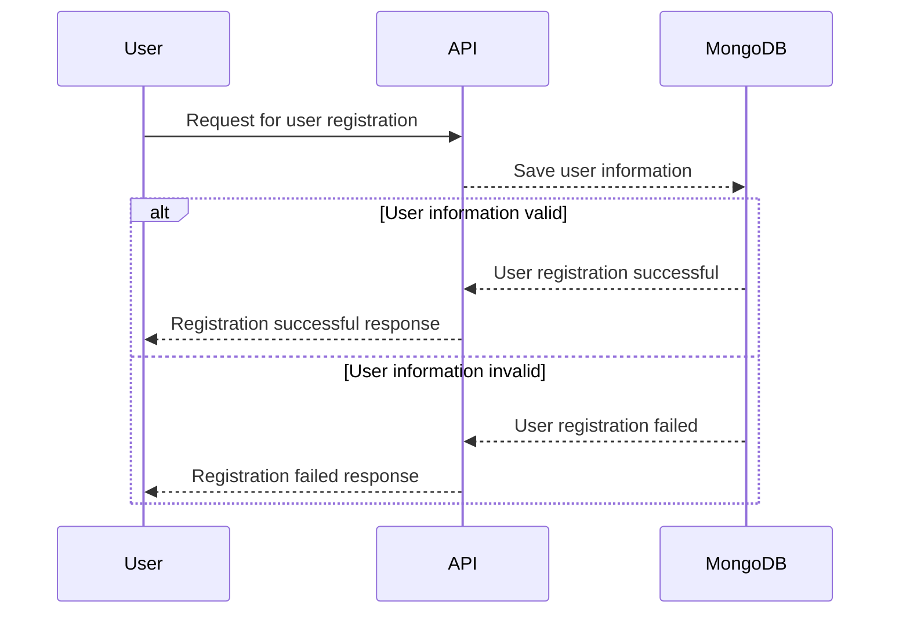

# demo-microservices-typescript
Our objective is to develop a robust and scalable web application using Node.js, focused on efficiently performing the saving and retrieval of user details

### Project Overview:

* Refine Objective: Instead of solely mentioning "user details," clarify the application's specific purpose and target audience. What problem does it solve? For whom?
* Highlight Uniqueness: Briefly mention what differentiates your application from similar ones to pique interest.

#### Technical Specifications:

* Frontend Framework: Offer options (e.g., React, Vue) instead of stating a preference without context. Explain reasons for each choice.
* Database: Briefly justify choosing Postgres over alternatives.

#### Functionalities:

* Consider adding additional functionalities relevant to user details based on user stories or market research.
* Ensure API definitions are well-documented (if applicable).

#### Performance and Scalability:
* Briefly elaborate on load handling strategies within the Docker image concept.

#### Testing:

* Consider incorporating end-to-end testing for a holistic view.
* Provide a high-level testing framework outlining phases and tools.

#### Security:
* Explain how Sonarcloud integrates with your security practices.
* Briefly mention how cyber security planning manifests in the architecture.
* Specify the phase(s) for web application security testing.

#### Observability:

* Briefly explain how Prometheus-Grafana and ELK Stack are used for monitoring.

#### Code Quality:

* Briefly clarify how integrated SCA components function in the pipeline.

#### README Draft:

##### Project Title: (Clear, concise, and descriptive)

##### Description: (Engaging overview of the project's purpose, target audience, and differentiators)

##### Architecture Sequence Diagram

##### Technology Stack:

* Node.js (Version 18)
* Database: Postgres (Alternative considerations mentioned)
* Frontend Framework: Options with justifications
* Repository: GitHub
* Other relevant technologies (Docker, testing frameworks, security tools, etc.)
##### Functionalities:

* Clear and concise list of core functionalities
##### Performance and Scalability:
* High-level overview of strategies
##### Testing:
* Summary of testing approach and tools
##### Security:
* Key security considerations and tools
##### Observability:
* Brief explanation of monitoring setup

Development Guidelines:

* Contribution guidelines
* Coding style guide (link or brief summary)
* Testing instructions

##### Additional Notes:

Include licensing information
Mention communication channels (e.g., issue tracker, forum)
Keep the README concise and well-formatted
Update it regularly as the project evolves
Remember, this is a general roadmap. Feel free to adapt and tailor it to your specific project and incorporate valuable feedback from others to create a comprehensive and informative README.

•	Project Overview:
Our objective is to develop a robust and scalable web application using Node.js, focused on efficiently performing the saving and retrieval of user details.

•	Technical Specifications:
-  Node.js Version: Node 18 - supported longer 
-  Database: Postgres  -- see better option
-  Frontend Framework: preferrable 
-  Repository: GitHub

•	Functionalities:
-	Save new data for user details.
-	Retrieve existing user details.
-	Update existing user details.
-	Delete user details.

•	Performance and Scalability:

The application should handle numerous loads by leveraging the Docker image concept to enhance scalability and performance.

•	Testing:
-	Unit testing 
-	Integration testing
-	Contract Testing
-	Mutation testing 
-	Load testing
•	Security :
-	Sonar cloud 
-	Shift left by including cyber security planning from project conception in the architecture phase . 
-	Web application security testing to be done on completed modules with tools like ZAP and BurpSuit
-	Container security checked with tools like QUAY.
•	Observability
-	Prometheus – Grafana
-	ELK Stack Configuration
•	Code quality:
-	Open-source testing with SAST,DAST,IAST tools
-	Integrate SCA component in the pipeline.
-	Dependency Scan (Snyk ) etc
-	

